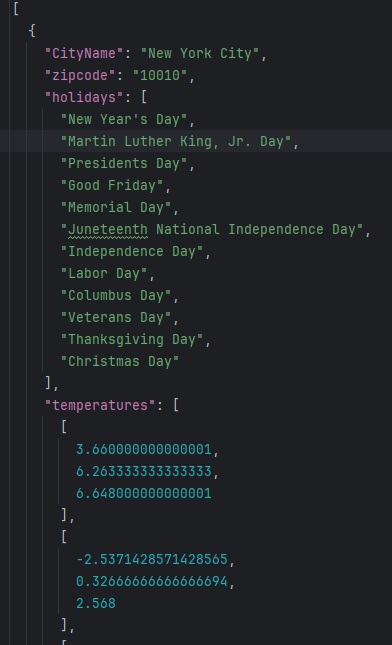

# A Simple Holiday App for Vacation Selection

- Input real valid zipcodes using "," to seperate (otherwise it's gonna crush).
- It will output a json file contains average temperatures (morning, afternoon, evening) of past 5 years on each
   US holidays for input zipcodes.

## Example Output (zipcodes: 10010,90210,99501)

  

 
